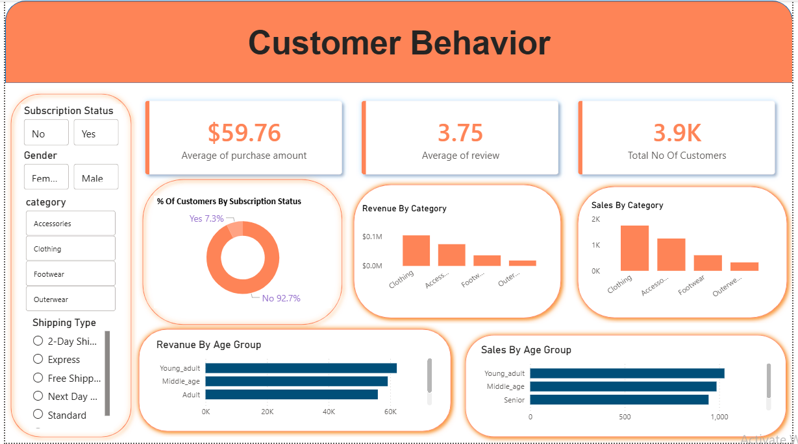

# Customer Behaviour Analysis

## Project Overview

This project focuses on analyzing customer shopping behavior using Python, SQL and Power BI.

The objective of this project was to clean the data, perform exploratory analysis and build an interactive dashboard to understand customer purchasing patterns and business insights.

---

## Dataset Information

The dataset contains customer information such as:

- Customer ID
- Age
- Gender
- Category
- Purchase Amount
- Review Rating
- Subscription Status
- Shipping Type
- Payment Method
- Frequency of Purchases

---

## Tools Used

- Python (Pandas)
- MySQL
- Power BI
- Microsoft Excel

---

## Project Workflow

1. Data Cleaning using Python
2. Data Transformation using Pandas
3. Loading Data into MySQL
4. SQL Analysis
5. Dashboard Creation in Power BI

---

## Dashboard Preview



---

## Dashboard Insights

The dashboard provides insights into:

- Average Purchase Amount
- Average Customer Review
- Total Number of Customers
- Subscription Status Analysis
- Revenue by Category
- Sales by Category
- Revenue by Age Group
- Sales by Age Group

---

## Files Included

- `customer_shopping_behavior.csv`
- `customer_behaviour.py`
- `shopping_behavior.sql`
- `Customer_Behavior.pbix`

---

## Project Structure

```text
Customer-Behaviour-Analysis
│
├── Dataset
│     └── customer_shopping_behavior.csv
│
├── Images
│     └── Dashboard.png
│
├── PowerBI
│     └── Customer_Behavior.pbix
│
├── Python
│     └── customer_behaviour.py
│
├── SQL
│     └── shopping_behavior.sql
│
└── README.md
```

---

## Key Learnings

Through this project, I improved my skills in:

- Data Cleaning using Pandas
- SQL Query Writing
- Data Transformation
- Dashboard Building in Power BI
- Generating Business Insights from Customer Data

---

## Author

**Shubham Yadav**

This project was completed as part of my Data Analytics learning journey to improve my Python, SQL and Power BI skills.
